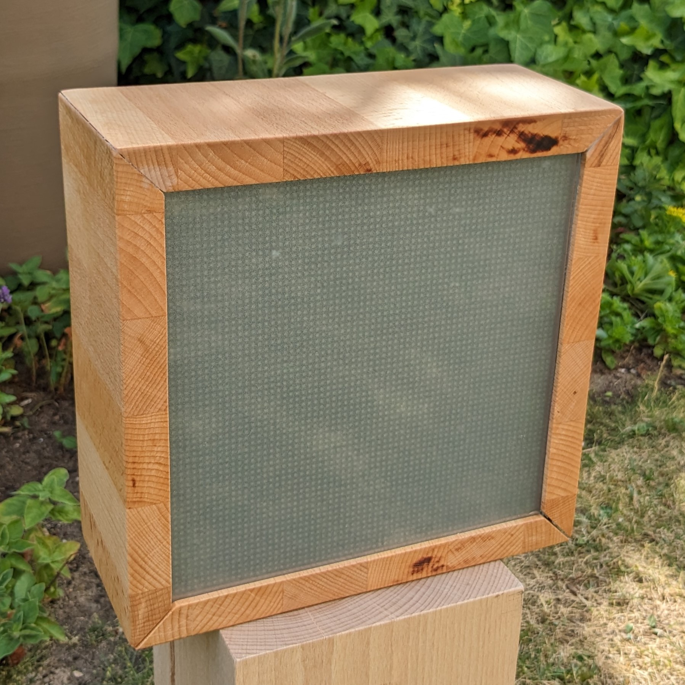

# 
DerEffi's Pixelart Display

## About

This project is an ESP32 Display Matrix for displaying images, time and social stats on a 64x64 LED Matrix Panel (HUB75E). An overview about the functionalities can be found at the Project Site [pixelart.dereffi.de](http://pixelart.dereffi.de).

## Disclaimer

This project is not a product, but rather a diy project. I won't sell it. I probably won't do another one at all. There are some minor issues/inconviniences that I plan to address in the future, but I can not make any promises on if or when that could happen.

That being said, in general I'm happy with the current state (althought it's not perfect) and the core functionality works as expected. You can use my code to rebuild it yourself or use parts of the code for your own project. If there are any issues, I'm pleased to help. If you have any solutions I'm even more pleased if you contribute.

## Usage/Deployment

The project consist of these parts:
- the controller for the display: [/pixelart-controller](./pixelart-controller/)
- an alternate controller (Raspberry PI) for the display currently under development and not ready for use: [/pixelart-controller-rpi](./pixelart-controller-rpi)
- the webinterface for remote control of the display: [/pixelart-interface](./pixelart-interface/)
- the socials api for retrieving social data from different platforms: [/pixelart-api](./pixelart-api/)

The documentations for these projects can be found in the different subdirectories as well as additional files for api, schematics and my dev board pinout under `/docs`.
An already compiled version of the firmware and the webinterface for the device can be found on the project site for download if you plan to use it as is.
Please be aware, that I won't be giving out any api-keys for my hosted social-api service (more on that under [/pixelart-api](./pixelart-api/README.md)), so you will have to host this on your own.

## Credits

Among a few other libraries I use in this project, thanks especially to: 
- [mrfaptastic's ESP32/HUB75 Library](https://github.com/mrfaptastic/ESP32-HUB75-MatrixPanel-DMA) used to output on the LED matrix at all
- [me-no-dev's Async Webserver library](https://github.com/me-no-dev/ESPAsyncWebServer) for making the webinterface possible
- [khoih-prog's Async HTTP Request Library](https://github.com/khoih-prog/AsyncHTTPSRequest_Generic) for retrieving social data on the controller
- [pgrimaud's instagram fetcher](https://github.com/pgrimaud/instagram-user-feed) for the retrieval of instagram data. Even if I don't use this library directly, I used it as a template for the authentication agains instagram apis

## Project Site

[pixelart.dereffi.de](http://pixelart.dereffi.de)

## Author

[DerEffi](https://dereffi.de)
[info@dereffi.de](mailto:info@dereffi.de)